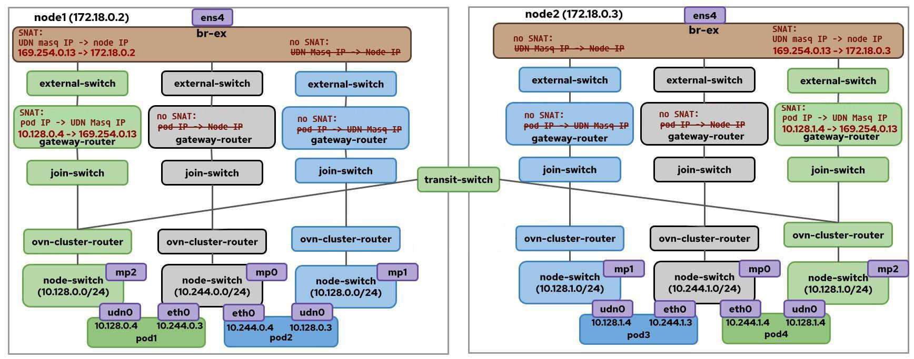

# OKEP-4368: No-overlay Mode For Layer-3 Networks

* Issue: [\#5259](https://github.com/ovn-kubernetes/ovn-kubernetes/issues/5259)  
* Authors: Riccardo Ravaioli, Peng Liu

## Problem Statement

Currently, OVN-Kubernetes uses Geneve as its encapsulation method on the overlay
network for east-west traffic; this adds overhead and reduces throughput. By
leveraging ovn-kubernetes support for BGP, we want to provide a way for users to
enable a no-overlay mode, which would disable Geneve encapsulation and use
direct routing between nodes for east-west traffic on selected networks.

Many environments, particularly on-premise deployments or those with dedicated
networking infrastructure, prefer to utilize the underlying physical network's
routing capabilities directly. This "no-overlay" approach can offer several
benefits:

* Improved Performance: Eliminates encapsulation/decapsulation overhead,
  potentially leading to lower latency and higher throughput for inter-pod
  communication.
* Simplified Troubleshooting: Traffic paths are more transparent as they align
  with the physical network's routing tables, simplifying debugging and network
  visibility.
* Leverage Existing Network Infrastructure: Integrates more seamlessly with
  existing BGP-capable network devices, allowing for direct routing to pod IPs.  
* Reduced Resource Consumption: Fewer CPU cycles spent on
  encapsulation/decapsulation.

## Goals

* Support no-overlay mode for the default network.
* Support no-overlay mode for Primary layer-3 ClusterUserDefinedNetworks
  (CUDNs).
* A cluster can have networks operating in overlay and no-overlay modes
  simultaneously.
* Use the BGP feature to exchange routes to node subnets across the cluster.
* Allow direct communication without any overlay encapsulation for east-west
  traffic.
* Maintain compatibility with existing OVN-Kubernetes features where applicable.
* Compatible with both local gateway and shared gateway modes.

## Future Goals

* When OVN-Kubernetes supports BGP for UserDefinedNetwork CRs, extend no-overlay
  mode support for Primary layer-3 UDNs.

* Support toggling no-overlay mode on/off for an existing network. To support
  this function, there are 2 things we need to consider.
  First, in no-overlay mode, as there is no Geneve overhead, a network can have
  the same MTU size as the provider network. However, overlay networks require a
  smaller MTU. We cannot modify a pod interface MTU without restarting the pod.
  So OVN-Kubernetes must work with other external controllers to accommodate
  such a migration.
  Secondly, to facilitate a smooth, node-by-node migration, it's crucial to
  allow networks to operate in a hybrid no-overlay and overlay mode.  

* Support EgressIP and EgressService features in networks operating in
  no-overlay mode. Both features leverage OVN-Kubernetes's logical routing
  policy to steer pod egress traffic. They also rely on overlay tunnels to
  transport pod egress traffic to egress nodes. Implementing these features in
  no-overlay mode with BGP requires significant architectural changes and
  careful consideration.

* Support a network operating in an overlay and no-overlay hybrid mode.
  Currently, BGP only supports advertising entire pod networks. In the future,
  we may add support for selective node advertisement, which will enable hybrid
  modes. This will allow networks to operate in overlay and no-overlay modes
  simultaneously. It is useful for scenarios such as overlay mode migration or
  hybrid provider networks.

## Non-Goals

* This enhancement does not aim to change the default behavior of
  OVN-Kubernetes, which will continue to use Geneve encapsulation for the
  default network and any user-defined networks unless no-overlay mode is
  explicitly enabled.

* This enhancement does not aim to change the existing CUDN/UDN isolation
  mechanism. CUDNs/UDNs will continue to be isolated from each other and the
  default network using OVN ACLs on every node logical switch.

* This enhancement does not aim to change the existing BGP configuration or
  behavior. The user must ensure that the BGP configuration is correctly set up
  to support no-overlay mode.

* This enhancement does not aim to change the existing CUDN lifecycle
  management. The user must ensure that the CUDN CRs are correctly managed
  according to the existing lifecycle management practices.

* This enhancement does not aim to implement no-overlay mode with the
  centralized OVN architecture, as the BGP feature is only available in a
  cluster running in interconnect mode.

* This enhancement does not aim to implement no-overlay mode for the layer-2 or
  localnet type of networks. The BGP feature doesn't support the localnet type
  of networks. The layer-2 type of networks is implemented by connecting pods to
  the same OVN distributed logical switch. Pods on different nodes are connected
  through a layer-2 segment using Geneve encapsulation. It's quite challenging
  to implement a layer-2 network over a layer-3 infrastructure without an
  overlay protocol.

## Introduction

In the [OVN-Kubernetes BGP Integration
enhancement](https://github.com/openshift/enhancements/blob/master/enhancements/network/bgp-ovn-kubernetes.md#no-tunneloverlay-mode),
no-overlay mode was briefly discussed. In this enhancement, we aim to describe
the feature in detail, define the API changes we want to introduce for it, and
address a number of concerns with respect to the existing BGP Integration and
User-Defined Network Segmentation features.

Avoiding Geneve encapsulation and using the provider network for east-west
traffic spawns from the need to minimize network overhead and maximize
throughput. Users who intend to enable BGP on their clusters can indeed leverage
BGP-learned routes to achieve this. The goal is to provide users with an API to
enable or disable no-overlay mode on selected networks (default or
user-defined), allowing traffic to skip Geneve encapsulation (i.e., the overlay
network) and simply make use of the learned routes in the underlay or provider
network for inter-node communication.

While BGP is the proposed solution for exchanging east-west routing information
within a cluster, it is not the only possible option. Future implementations of
no-overlay mode may incorporate additional routing technologies and protocols
beyond BGP.

## User-Stories/Use-Cases

### Story 1: Enable no-overlay mode for the default network

As a cluster admin, I want to avoid all encapsulation for traffic in the default
network to integrate seamlessly with existing BGP-capable networks, achieve
maximum network performance, and simplify troubleshooting.

### Story 2: Enable no-overlay mode for a CUDN

As a cluster admin, I want to avoid all encapsulation for traffic in a CUDN to
integrate seamlessly with existing BGP-capable networks, achieve maximum network
performance, and simplify troubleshooting.

### Story 3: Enable no-overlay mode without an external BGP router

As a cluster admin, I want to avoid all encapsulation for traffic in the
cluster, but I don't want to deploy an external BGP router for the OCP cluster.

## Proposed Solution

The core idea is to leverage the existing BGP feature to advertise the IP subnet
allocated to each node (which contains the IPs of pods running on that node) to
an internal/external BGP route reflector. The BGP route reflector will then
populate these routes throughout the physical network, allowing other nodes to
directly route traffic to pod IPs without needing an overlay. Within a cluster,
different networks can operate in different overlay modes. Users can have
overlay and no-overlay networks simultaneously.

When no-overlay mode is enabled for a network:

* For north-south traffic, we will follow the existing implementation of the BGP
  feature; the traffic from pods will no longer be SNATed on egress. In the BGP
  feature, SNAT is disabled for all pod egress traffic that leaves the node,
  regardless of whether the destination route is BGP learnt or not. For users
  who only want to have no-overlay mode but do not want to expose podIPs to the
  external, this behavior is not ideal. Instead of disabling SNAT for all the
  pod-to-external traffic, OVN-K shall adjust its SNAT behavior so that pod IPs
  are exposed for traffic routed via BGP, but SNAT is still applied for
  non-BGP-routed egress traffic.

* For east-west traffic, intra-node traffic (pod-to-pod, pod-to-clusterIP, and
  pod-to-host) remains unchanged, while cross-node traffic will follow the same
  path as north-south traffic.

For the default network, we will add a new flag
`--default-network-encapsulation` to the ovnkube binary. This flag accepts
either `none` or `geneve`, with `geneve` being the default. Setting
`--default-network-encapsulation=none` will configure the default network to
operate in no-overlay mode.

For CUDNs, no-overlay mode shall be configured via the CUDN CRs.

### API Details

We introduce a new `layer3.encapsulation` field to be added to the Spec of the
ClusterUserDefinedNetwork (CUDN) CRD. This new field will enable control over
the network encapsulation behavior with the following options:

1. **Encapsulation Configuration**:  
   * `encapsulation`: specifies the encapsulation method (default: `Geneve`)  
   * Supported values: `Geneve` (default) or `None` (no overlay)

The `spec` field of a ClusterUserDefinedNetwork CR is immutable. Therefore, you
can't change the encapsulation setup once a ClusterUserDefinedNetwork CR is
created.

#### Example of a layer-3 CUDN with no-overlay mode enabled

A layer-3 CUDN with no-overlay mode enabled should look like this:

```yaml
apiVersion: k8s.ovn.org/v1
kind: ClusterUserDefinedNetwork
metadata:
  name: my-cudn
spec:
  namespaceSelector:
    matchExpressions:
    - key: kubernetes.io/metadata.name
      operator: In
      values: ["red", "blue"]
  network:
    topology: Layer3
    layer3:
      role: Primary
      mtu: 1500
      subnets:
      - cidr: 10.10.0.0/16
        hostSubnet: 24
      encapsulation: None
```

The topology spec for each network type is shared between CUDN and UDN. Once we
add the new `encapsulation` field, it will be available for both CUDN and UDN.
So, to prevent a user from setting this field in a UDN CR accidentally, a new
`status.conditions` type `NoOverlayEnabled` will be added to CUDN/UDN CRs. If a
user tries to create a UDN CR with no overlay mode enabled, cluster-manager
shall set the `status.condition` type `NoOverlayEnabled` to `false` with the
reason `NotSupported`.

```
  status:
    conditions:
    - lastTransitionTime: "2025-06-10T04:53:41Z"
      message: 'No-overlay mode is not supported for UDNs'
      reason: NoOverlayEnabled
      status: "False"
      type: NotSupported

```

### Implementation Details

No-overlay mode relies on the BGP feature, which is exclusive to clusters
deployed in the single-node zone interconnect mode. Therefore, no-overlay mode
can only be enabled in clusters configured with single-node zone interconnect.

For networks configured with no-overlay mode, the OVN topology requires minor
adjustments. It is useful to remember that in today's interconnect architecture,
a network is able to span all cluster nodes thanks to the cross-node logical
links that OVN establishes between the transit switch and the ovn-cluster-router
instances on each node. That is the logical representation of the OVN network,
and in practice, these links are implemented through Geneve tunnels between
every node in the cluster. For a network to skip the encapsulation step and
route pod traffic directly over the underlay network, we need to change the
logical network topology of this network: its ovn-cluster-router won't connect
to the transit switch anymore and all east-west traffic will be naturally routed
in the same path as north-south traffic through the provider network.

The following diagram shows the OVN topology of a cluster with three networks:

* a CUDN (in green) that uses Geneve encapsulation (default behavior)  
* a default network (in gray) that is operating in no-overlay mode  
* a CUDN (in blue) that is operating in no-overlay mode



We need to update the ZoneInterconnectHandler for no-overlay mode. If a new
network is configured in no-overly mode, ZoneInterconnectHandler shall not
create the transit switch for the network. For each remote zone, there is no
need to add the static nodeSubnet routes into the ovn_cluster_router. The
traffic shall be forwarded following the source-based route instead. The nexthop
depends on the gateway mode of the cluster.

#### Shared Gateway Mode

At the OVN ClusterRouter, the pod-to-remote_pod egress traffic will be
forwarded to the GatewayRouter via the join switch. Unlike the current route
advertisement behavior, the routes to remote node subnets will be imported to
the gateway router. Once the traffic reaches the GatewayRouter, it will be
forwarded to the nexthop node according to the imported BGP routes.

Pseudo traffic path would look like this (assuming pod IP of 10.128.0.10,
destined to remote pod 10.128.2.11):

```
pod --> ovn_cluster_router -> GR(match a BGP route 10.128.2.0/23 nexthop 172.18.0.3) -> br-ex()  --> eth0
```

To maintain SNAT for non-BGP-routed egress traffic, in the gateway router, the
default SNAT rule will be kept. The route import controller will add a Logical
Router Policy (LRP) to the gateway router for each BGP imported route to skip
the SNAT rule.

In the following example, `10.128.0.0/24` is the local nodeSubnet,
`174.16.1.0/24` is the CIDR of a BGP route.

```
100 ip4.src == 10.128.0.0/24 && ip4.dst == 174.16.1.0/24         outport                rtoe-GR_ovn-worker
```

#### Local Gateway Mode

The pod-to-remote_pod traffic egress traffic will enter the host VRF via the
ovn-k8s-mpX interface. Then it will be forwarded to remote nodes according to
the host routing table of the VRF.

Pseudo traffic path would look like this (assuming pod IP of 10.128.0.10,
destined to remote pod 10.128.2.11):

```
pod --> ovn_cluster_router -> ovn-k8s-mp0 -> host(match a BGP route 10.128.2.0/23 nexthop 172.18.0.3) -> br-ex() --> eth0
```

To maintain SNAT for non-BGP-routed egress traffic, the masquerade iptables rule
will be kept. The route import controller will insert a iptables rule for each
BGP imported route to skip the SNAT rule to the gateway router.

In the following example, `10.128.0.0/24` is the local nodeSubnet,
`174.16.1.0/24` is the CIDR of a BGP route.

```
-A POSTROUTING -s 10.128.0.0/24 -d 174.16.1.0/24 -j RETURN
-A POSTROUTING -s 10.128.0.0/24 -j MASQUERADE
```

#### Import Routes to NodeSubnets

Changes to BGP behavior are necessary to import nodeSubnet routes into the
gateway router and the host routing table of each node. A new field
`encapsulation`, will be introduced to the NAD spec which indicates the
encapsulation of the network. If a network is operating in no-overlay mode, this
field will be set to `none`. This information can then be passed into the
NetInfo object and utilized by both the RouteAdvertisement controller and the
route import controller as described below.

An example OVN-Kubernetes NAD may look like:

```yaml
apiVersion: k8s.cni.cncf.io/v1
kind: NetworkAttachmentDefinition
metadata:
  name: l3-network
  namespace: default
spec:
  config: |2
    {
            "cniVersion": "0.3.1",
            "name": "l3-network",
            "type": "ovn-k8s-cni-overlay",
            "topology":"layer3",
            "mtu": 1500,
            "netAttachDefName": "default/l3-network",
            "role": "primary",
            "encapsulation": none
    }
```

##### Gateway Router

Currently, BGP routes to other node subnets are not imported into the gateway
router, which ensures node-to-pod traffic traverses the OVN logical topology.
However, we need the routes to be imported into the gateway router in no-overlay
mode. We need to update the route import controller to check whether a network
is in no-overlay mode and handle the route importing accordingly.

##### Host Routing Tables

To [maintain isolation between UDNs](https://github.com/ovn-kubernetes/ovn-kubernetes/pull/5140),
node BGP speakers do not accept routes to NodeSubnets by default. However, to
route east-west traffic in no-overlay mode, these routes must be imported to the
host routing table. We need to update the node FRRConfiguration generation logic
to check whether a network is in no-overlay mode and generate the node
FRRConfiguration accordingly.

#### No SNAT for egress traffic

The OVN-Kubernetes BGP feature currently disables SNAT only for traffic destined
to external networks, not for inter-pod communication across nodes.

In no-overlay mode, the goal is to fully leverage BGP and eliminate the SNAT
step on the gateway router, even for intra-cluster traffic. Within the same
network, pod-to-pod traffic will utilize BGP-learned routes to reach its
destination node directly, bypassing Geneve encapsulation and SNAT to the
nodeIP.

The only exception is for pod-to-other_node traffic, to ensure nodePort
services can be accessed across networks. This egress traffic will remain SNATed
to the node IP before leaving the node. This is the current behavior when a
network is advertised. We will not change it for no overlay mode.

#### Active traffic blocking between UDNs

The [existing UDN isolation
mechanism](https://github.com/ovn-kubernetes/ovn-kubernetes/pull/5186/commits/8f6e7d30ee5f4926a21e2de75488aad80344814b)
will still be in place. Pods in different UDNs will be isolated from each other
and the default network, utilizing the existing OVN ACLs on every node logical
switch: ACLs are enforced on outgoing traffic at each advertised UDN switch,
verifying whether both source and destination IPs belong to the same advertised
UDN. If the destination IP does not come from the same UDN subnet as the source
IP, traffic is dropped. No-overlay mode will not affect the isolation between
UDNs or between UDNs and the default network. So, even if multiple UDNs were
advertised to the same VRF, the cross-UDN traffic is still blocked. This is the
current behavior when a network is advertised. We will not change it for no
overlay mode.

### Workflow

#### Enable No-overlay Mode for the Default Network

1. The frr-k8s pod shall be deployed on each node.  
2. Before starting the ovnkube pods, the cluster admin shall create a base
   FRRConfiguration CR that is used for generating the per-node FRRConfiguration
   by OVN-K.

    ```yaml
    apiVersion: frrk8s.metallb.io/v1beta1
    kind: FRRConfiguration
    metadata:
      name: cudn-1
      namespace: frr-k8s-system
      # A custom label
      label:
        network: default
    spec:
      bgp:
        routers:
        - asn: 64512
          neighbors:
          # the external BGP route reflector
          - address: 172.20.0.2
            asn: 64512
            disableMP: true
    ```

3. The cluster admin shall create a RouterAdvertisments CR to advertise the
   default network. Make sure the RouterAdvertisments CR selects the
   FRRConfiguration defined in the last step.

    ```yaml
    apiVersion: k8s.ovn.org/v1
    kind: RouteAdvertisements
    metadata:
      name: default
    spec:
      advertisements:
      - PodNetwork
      # Select the FFConfiguration defined in step-2 with the custom label.
      frrConfigurationSelector:
        matchLabels:
          network: default
      networkSelectors:
      - networkSelectionType: DefaultNetwork
      # The empty nodeSelector selects all nodes. We don't support a network in a overlay and no-overlay hybrid mode.
      nodeSelector: {}
    ```

4. The cluster admin enables no-overlay mode by running ovn-kubernests with the
   configuration flag `--default-network-encapsulation=none` set.  
5. OVN-Kubernetes will generate the following FRRConfiguration for each node.

    ```yaml
    apiVersion: frrk8s.metallb.io/v1beta1
    kind: FRRConfiguration
    metadata:
      name: route-generated-blue
      namespace: frr-k8s-system
    spec:
      bgp:
        routers:
        - asn: 64512
          neighbors:
          - address: 10.89.0.37
            asn: 64512
            disableMP: true
            toAdvertise:
              allowed:
                prefixes:
                # Advertise the local nodeSubnet
                - 10.244.1.0/24
            toReceive:
              # Allow to receive the routes to remote nodeSubnets.
              # This is no-overlay specific behavior.
              allowed:
                mode: filtered
                prefixes:
                - ge: 24
                  le: 24
                  prefix: 10.244.0.0/14
          prefixes:
          - 10.244.1.0/24
    ```

#### Create A ClusterUserDefinedNetwork in No-overlay Mode

Here's a configuration example:

1. The frr-k8s pod shall be deployed on each node.  
2. A cluster admin wants to enable no-overlay mode for the blue network by
   creating the following ClusterUserDefinedNetwork CR.

    ```yaml
    apiVersion: k8s.ovn.org/v1
    kind: ClusterUserDefinedNetwork
    metadata:
      name: blue
      # A custom label
      label:
        network: blue
    spec:
      namespaceSelector:
        matchExpressions:
        - key: kubernetes.io/metadata.name
          operator: In
          values: ["ns1", "ns2"]
      network:
        topology: Layer3
        layer3:
          role: Primary
          # The UDN MTU shall not be larger than the provider network's MTU.
          mtu: 1500
          subnets:
          - cidr: 10.10.0.0/16
            hostSubnet: 24
          encapsulation: None
    ```

3. The cluster admin has created an FRRConfiguration CR to peer with an external
   BGP router `182.18.0.5`.

    ```yaml
    apiVersion: frrk8s.metallb.io/v1beta1
    kind: FRRConfiguration
    metadata:
      name: blue
      namespace: frr-k8s-system
      # A custom label
      labels:
        network: blue
    spec:
      bgp:
        routers:
        - asn: 64512
          neighbors:
          - address: 182.18.0.5
            asn: 64512
            disableMP: true
            holdTime: 1m30s
            keepaliveTime: 30s
            passwordSecret: {}
            port: 179
            toAdvertise:
              allowed:
                mode: filtered
            toReceive:
              # Allow to accpet the routes to remote nodeSubnets.
              allowed:
                mode: filtered
                prefixes:
                - ge: 24
                  le: 24
                  prefix: 10.10.0.0/16
    ```

4. The cluster admin advertises the CUDN pod network. In this example, the
   `targetVRF` is set to default, meaning routes to the podNetworks will be
   advertised to the default VRF.

    ```yaml
    apiVersion: k8s.ovn.org/v1
    kind: RouteAdvertisements
    metadata:
      name: blue
    spec:
      # advertise routes to the default VRF
      targetVRF: default
      # nodeSelector must be empty, since we don't support a network in a overlay and no-overlay hybrid mode.
      nodeSelector: {}
      frrConfigurationSelector:
        matchLabels:
        # Select the FRRConfiguration defined in step-3
        network: blue
      networkSelectors:
      - networkSelectionType: ClusterUserDefineNetwork
        clusterUserDefinedNetworkSelector:
          networkSelector:
            matchLabels:
              # Select the CUDN defined in step-2
              network: blue
      advertisements:
      - PodNetwork
    ```

5. OVN-Kubernetes will generate the following FRRConfiguration for each node.

    ```yaml
    apiVersion: frrk8s.metallb.io/v1beta1
    kind: FRRConfiguration
    metadata:
      name: route-generated-blue
      namespace: frr-k8s-system
    spec:
      bgp:
        routers:
        - asn: 64512
          neighbors:
          - address: 182.18.0.5
            disableMP: true
            asn: 64512
            toAdvertise:
              allowed:
                prefixes:
                # the local node subnet
                - 10.10.1.0/24
            toReceive:
              # Allow to receive the routes to remote nodeSubnets.
              # This is no-overlay specific behavior.
              allowed:
                mode: filtered
                prefixes:
                - ge: 24
                  le: 24
                  prefix: 10.10.0.0/16
          prefixes:
          - 10.0.1.0/24
    ```

### Deployment Consideration

#### BGP Topology

The selected FRRConfiguration CR determines the deployment mode for the
no-overlay network. There will be no new field added to the FRRConfiguration.
The goal is to exchange the routes to the nodeSubnets across the cluster. The
possible BGP topologies are various. Users shall be able to choose any topology
that is most suitable for their use-case. However, frr and frr-k8s may not
support some BGP features. Here we just list some basic iBGP deployment options.

##### Full-Mesh iBGP across the Cluster

The FRR instance on each node maintains a full mesh BGP peer relationship with
all other nodes across the cluster. In this mode, users can enable no-overlay
mode without relying on external BGP routes.

Here's an example FRRConfiguration:

```yaml
apiVersion: frrk8s.metallb.io/v1beta1
kind: FRRConfiguration
metadata:
  labels:
    network: default
  name: receive-all
  namespace: openshift-frr-k8s
spec:
  bgp:
    routers:
    - asn: 64512
      # All nodes are added as neighbors to setup a full-mesh BGP topology
      neighbors:
      - address: 192.168.111.20
        asn: 64512
        disableMP: true
        toReceive:
          allowed:
            mode: all
      - address: 192.168.111.21
        asn: 64512
        disableMP: true
        toReceive:
          allowed:
            mode: all
      - address: 192.168.111.22
        asn: 64512
        disableMP: true
        toReceive:
          allowed:
            mode: all
```

##### External Route Reflectors for Larger Clusters

In a large cluster, a full-mesh BGP setup leads to more CPU and memory
consumption on the nodes. Instead of every node peering with every other node,
nodes peer only with external BGP route reflectors. This significantly reduces
the number of BGP sessions each node needs to maintain, improving scalability.

##### Internal Route Reflectors

While an FRR instance can act as a BGP route reflector, enabling an internal
route reflector-based BGP network across the cluster. But it is not currently
supported by frr-k8s, which we use for integrating OVN-K with FRR. So this is
not a possible deployment today.

### Feature Compatibility

#### Multiple External Gateways (MEG)

The same as the route advertisement feature.

#### Egress IP

Not supported.

#### Services

The same as the route advertisement feature.

#### Egress Service

Not supported.

#### Egress Firewall

Full support.

#### Egress QoS

Full Support.

#### Network Policy/ANP

Full Support.

#### IPsec

Not supported.

### Testing Details

* Unit Testing details
* E2E Testing details
* API Testing details
* Scale Testing details
* Cross Feature Testing details - coverage for interaction with other features

## Risks, Known Limitations and Mitigations

## OVN Kubernetes Version Skew

To be discussed.

## Alternatives

N/A

## References

1. [OVN-Kubernetes BGP Integration](https://github.com/openshift/enhancements/blob/master/enhancements/network/bgp-ovn-kubernetes.md#no-tunneloverlay-mode)
2. [OKEP-5193: User Defined Network Segmentation](https://github.com/ovn-kubernetes/ovn-kubernetes/blob/master/docs/okeps/okep-5193-user-defined-networks.md)
