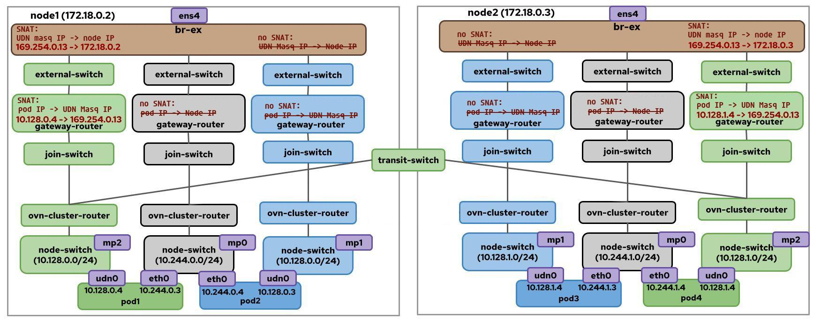

# OKEP-4368: No-overlay Mode For Layer-3 Networks

* Issue: [#5259](https://github.com/ovn-kubernetes/ovn-kubernetes/issues/5259)
* Authors: Riccardo Ravaioli, Peng Liu

## Problem Statement

Currently OVN-Kubernetes uses Geneve as its encapsulation method on the overlay
network for east/west traffic; this adds overhead and reduces throughput. By
leveraging ovn-kubernetes support for BGP, we want to provide a way for users to
enable a no-overlay mode, which would disable Geneve encapsulation and use
direct routing between nodes for east/west traffic on selected networks.

Many environments, particularly on-premise deployments or those with dedicated
networking infrastructure, prefer to utilize the underlying physical network's
routing capabilities directly. This "no-overlay" approach can offer several
benefits:

* Improved Performance: Eliminates encapsulation/decapsulation overhead,
  potentially leading to lower latency and higher throughput for inter-pod
  communication.
* Simplified Troubleshooting: Traffic paths are more transparent as they align
  with the physical network's routing tables, simplifying debugging and network
  visibility.
* Leverage Existing Network Infrastructure: Integrates more seamlessly with
  existing BGP-capable network devices, allowing for direct routing to pod IPs.
* Reduced Resource Consumption: Less CPU cycles spent on
  encapsulation/decapsulation.

## Goals

* Support no-overlay mode for the default network
* Support no-overlay mode for Primary layer-3 Cluster User Defined Networks
  (CUDNs) in the VRF-lite mode.
* A cluster can have networks operating in overlay and no-overlay modes
  simultaneously.
* Use the route advertisements feature to exchange routes to node subnets across
  the cluster.
* Allow direct pod-to-pod communication without any overlay encapsualtion for
  West-East traffic.
* Ensure East-West network policies are still enforced by OVN.
* Maintain compatibility with existing OVN-Kubernetes features where applicable
  (e.g., Services, NetworkPolicy, EgressIP, EgressFirewall, AdminNetworkPolicy).
* Compatible with both local gateway and shared gateway modes.
  
## Future Goals

* When OVN-Kubernetes supports BGP for UDN CRs, extend the UDN API to
  enable no-overlay mode on Primary UDNs.
* Support toggling no-overlay mode on/off for an existing network.

## Non-Goals

* This enhancement does not aim to change the default behavior of
  OVN-Kubernetes, which will continue to use Geneve encapsualtion for the
  default network and any user-defined networks unless no-overlay mode is
  explicitly enabled.
* This enhancement does not aim to change the existing CUDN/UDN isolation
  mechanism. CUDNs/UDNs will continue to be isolated from each other and from
  the default network by means of OVN ACLs on every node logical switch.
* This enhancement does not aim to change the existing BGP configuration or
  behavior. The user must ensure that the BGP configuration is correctly set up
  to support no-overlay mode.
* This enhancement does not aim to change the existing CUDN lifecycle
  management. The user must ensure that the CUDN CRs are correctly managed
  according to the existing lifecycle management practices.
* This enhancement does not aim to implement the no-overlay mode with the
  centralized OVN architecture.
* This enhancement does not aim to implement the no-overlay mode for layer-2 or
  localnet type of networks.
* This enhancement does not aim to support an overlay and no-overlay hybrid
  network.

## Introduction

In the [BGP
enhancement](https://github.com/openshift/enhancements/blob/master/enhancements/network/bgp-ovn-kubernetes.md#no-tunneloverlay-mode),
the no-overlay mode was briefly discussed. In this enhancement we aim to
describe the feature in detail, define the API changes we want to introduce for
it and address a number of concerns with respect to the existing BGP and CUDN
features.

Avoiding Geneve encapsualtion and using directly the infrastructure network for
east/west traffic spawns from the need of minimizing network overhead and
maximizing throughput. Users who intend to enable BGP on their clusters can
indeed leverage BGP-learned routes to achieve this. The goal is to provide users
with an API to enable or disable no-overlay mode on selected networks (default
or user-defined), allowing traffic to skip Geneve encapsualtion (i.e. the
overlay network) and simply make use of the learned routes in the underlay or
provider network for inter-node communication.

However, BGP is not the only option of exchanging the east-west routing
information within a cluster. In the future, the no-overlay mode may support
other approaches.

## User-Stories/Use-Cases

### Story 1: enable no-overlay mode for the default network

As a cluster admin, I want to avoid all encapsulation for traffic in the default
network to integrate seamlessly with existing BGP-capable network, achieve
maximum network performance and simplify troubleshooting.

### Story 2: enable no-overlay mode for a CUDN

As a cluster admin, I want to avoid all encapsulation for traffic in a CUDN to
integrate seamlessly with existing BGP-capable network, achieve maximum network
performance and simplify troubleshooting.

### Story 3: enable no-overlay mode without an external BGP router

As a cluster admin, I want to avoid all encapsulation for traffic in the cluster,
but I don't want to deploy an external BGP router for the OCP cluster.

## Proposed Solution

The core idea is to leverage the existing Route Advertisement feature to
advertise the IP subnet allocated to each node (which contains the IPs of pods
running on that node) to an internal/external BGP route reflector. The BGP route
reflector will then populate these routes throughout the physical network,
allowing other nodes to directly route traffic to pod IPs without needing an
overlay. Within a cluster, different networks can operate in different overlay
modes. Users can have overlay and no-overlay networks simultaneously.

When the no-overlay mode is enabled for a network:

* For north-south traffic, we will follow the implementation of the Route
  Advertisement feature, the traffic from pods will no longer be SNATed on
  egress. In the route advertisement feature, SNAT is disabled for all pod
  egress traffic that leaves the node, regardless of whether the destination
  route is BGP learnt or not. For users who only want to have no-overlay mode
  but do not want to expose podIPs to external, this behavior is not ideal.
  Instead of disabling SNAT for all the pod-to-external traffic, OVN-K shall
  adjust its SNAT behavior so that pod IPs are exposed for traffic routed via
  BGP, but SNAT is applied for non-BGP-routed egress traffic.

* For east-west traffic, intra-node traffic (pod-to-pod, pod-to-clusterIP and
  pod-to-host) remains unchanged, while cross-node traffic will follow the same
  path as north-south traffic.

### API Details

We introduce a new `layer3.encapsulation` field to be added to the Spec of the
ClusterUserDefinedNetwork (CUDN) CRD. This
new field will enable control over the network encapsualtion behavior with the
following options:

1. **Encapsulation Configuration**:
   * `encapsulation`: specifies the encapsualtion method (default: `Geneve`)
   * Supported values: `Geneve` (default) or `None` (no overlay)

The `spec` field of a ClusterUserDefinedNetwork CR is immutable. Therefore, the
encapsulation configuration cannot be changed once a ClusterUserDefinedNetwork
CR is created.

#### Example of a layer-3 CUDN with no-overlay mode enabled

A layer-3 CUDN that enables no-overlay mode should look like this:

```yaml
apiVersion: k8s.ovn.org/v1
kind: ClusterUserDefinedNetwork
metadata:
  name: my-cudn
spec:
  namespaceSelector:
    matchExpressions:
    - key: kubernetes.io/metadata.name
      operator: In
      values: ["red", "blue"]
  network:
    topology: Layer3
    layer3:
      role: Primary
      mtu: 1500
      subnets:
      - cidr: 10.10.0.0/16
        hostSubnet: 24
      encapsulation: None
```

#### Example of the default network with no-overlay mode enabled

For the cluster default network, the cluster admin shall create a
ClusterUserDefinedNetwork CR with the reserved name `default` and set
encapsulation to `None` to enable no-overlay mode before deploying
OVN-Kubernetes. For this CR, OVN-K shall not create the corresponding
NetworkAttachementDefinition CR. The subnet field must be aligned with the value
in `cluster-subnets` parameter. The MTU shall not be larger than the node
interface MTU.

```yaml
apiVersion: k8s.ovn.org/v1
kind: ClusterUserDefinedNetwork
Metadata:
  # 'default' is the reserved name to represent the cluster default network
  name: default
spec:
  # use an empty selector to select all namespaces
  namespaceSelector: {}
  network:
    topology: Layer3
    layer3:
      role: Primary
      mtu: 1500
      subnets:
      - cidr: 10.244.0.0/16
        hostSubnet: 24
      encapsulation: None
```

### Implementation Details

No-overlay mode is only available when OVNK interconnect is enabled, since it
relies on the route advertisement feature, which only works with interconnect
mode.

A network that is configured to use no-overlay mode needs a slightly modified
OVN topology. It is useful to remember that in today's interconnect architecture
a network is able to span all cluster nodes thanks to the cross-node logical
links that OVN establishes between the transit switch and the ovn-cluster-router
instances on each node. That is the logical representation of the OVN network
and in practice these links are implemented through Geneve tunnels between every
node in the cluster. For a network to skip the encapsulation step and route pod
traffic directly over the underlay network, we need to change the logical
network topology of this network: its ovn-cluster-router won't connect to the
transit switch anymore and all east-west traffic will be naturally routed in the
same path as north-south traffic through the provider network.

In Shared Gateway Mode, at the OVN ClusterRouter, the pod-to-remote_pod egress
traffic will be forwarded to the GatewayRouter via the join switch. Unlike the
current route advertisement behavior, the routes to remote node subnets will be
imported to the Gateway Router. Once the traffic reaches the GatewayRouter, it
will be forwarded the nexthop node according to routes learnt from BGP.

In Local Gateway Mode, the pod-to-remote_pod traffic egress traffic will enter
the host VRF via the ovn-k8s-mpX interface. Then it will be forwarded to remote
nodes according to the host routes of the VRF.

The following diagram shows the OVN topology of a cluster with three networks:

* a CUDN (in green) that uses Geneve encapsulation (default behavior)
* a default network (in gray) that enables no-overlay mode
* a CUDN (in blue) that enables no-overlay mode



#### No SNAT in no-overlay mode for egress traffic

The BGP feature in ovn-kubernetes only disables SNAT for traffic that is
destined to external networks, not for traffic that is destined to other pods in
the cluster.

In no-overlay mode, we want to fully leverage BGP and avoid the SNAT step on the
gateway router for intra-cluster traffic as well. Pod-to-pod traffic within the
same network will hit the BGP-learned routes to reach its destination node,
without being encapsulated in a Geneve tunnel and without being SNATed to the
node IP.

The only exception is for pod-to-other_node traffic, to ensure nodePort services
can be accessed across networks. The egress traffic will be SNATed to the node
IP before leaving the node.

#### Isolation between UDNs with no-overlay mode enabled

The [existing UDN isolation
mechanism](https://github.com/ovn-kubernetes/ovn-kubernetes/pull/5186/commits/8f6e7d30ee5f4926a21e2de75488aad80344814b)
will still be in place. Pods in different UDNs will be isolated from each other
and from the default network by means of the existing OVN ACLs on every node
logical switch: ACLs are enforced on outgoing traffic at each advertised UDN
switch, verifying whether both source and destination IPs belong to the same
advertised UDN. If the destination IP does not come from the same UDN subnet as
the source IP, traffic is dropped. The no-overlay mode will not affect the
isolation between UDNs or between UDNs and the default network.

### Workflow

#### Enable No-overlay Mode for the Default Network

No-overlay mode for the default network must be enabled before OVN-Kubernetes
pods start. Therefore, the following configuration manifests shall be created
before deploying the OVN-Kubernetes pods.

1. The cluster admin enables no-overlay mode by creating the well-known
   `default` UDN CR with `spec.layer3.encapsulation` set to `None`.

    ```yaml
    apiVersion: k8s.ovn.org/v1
    kind: ClusterUserDefinedNetwork
    metadata:
      # 'default' is the reserved name to represent the cluster default network
      name: default
    spec:
      # use an empty selector to select all namespaces
      namespaceSelector: {}
      network:
        topology: Layer3
        layer3:
          role: Primary
          mtu: 1500
          subnets:
          - cidr: 10.244.0.0/16
            hostSubnet: 24
          encapsulation: None
    ```

1. OVN-kubernetes cluster manager watches the `default` CUDN CR. If
   `spec.layer3.encapsulation` equals `None`, cluster manager will create a
   `RouteAdvertisement` CR which will advertise pod subnets in the default
   network:

    ```yaml
    apiVersion: k8s.ovn.org/v1
    kind: RouteAdvertisements
    metadata:
      name: default
    spec:
      # nodeSelector must be empty, since we don't support a network in a overlay and no-overlay hybrid mode.
      nodeSelector: {}
      frrConfigurationSelector:
        matchLabels:
          network: default
      networkSelectors:
        - networkSelectionType: DefaultNetwork
      advertisements:
      - PodNetwork
    ```

1. The cluster admin will have to create an `FRRConfiguration` CR that connects
   all the node FRR BGP speakers via either a route reflector or in full-mesh.
   The `FRRConfiguration` CR shall allow receiving the routes to the node
   subnets. Here's an example of using an external route reflector:

    ```yaml
    apiVersion: frrk8s.metallb.io/v1beta1
    kind: FRRConfiguration
    metadata:
      name: receive-filtered
      namespace: frr-k8s-system
      labels:
        network: default
    spec:
      bgp:
        routers:
        - asn: 64512
          neighbors:
          # An external BGP neighbor acts as a route reflector
          - address: 10.89.0.37
            asn: 64512
            disableMP: true
            toReceive:
              allowed:
                mode: filtered
    ```

1. OVN-Kubernetes will generate a following FRRConfiguration for each node.

    ```yaml
    apiVersion: frrk8s.metallb.io/v1beta1
    kind: FRRConfiguration
    metadata:
      name: route-generated-blue
      namespace: frr-k8s-system
    spec:
      bgp:
        routers:
        - asn: 64512
          neighbors:
          - address: 10.89.0.37
            asn: 64512
            disableMP: true
            toAdvertise:
              allowed:
                prefixes:
                # the node subnet of this node
                - 10.244.1.0/24
          prefixes:
          - 10.244.1.0/24
    ```

#### Create A ClusterUserDefinedNetwork in No-overlay Mode

For user defined networks, to ensure the traffic isolation, no-overlay mode can
only be enabled when the route advertisement is configured in a VRF-Lite mode.
The cross node east-west traffic in this user defined network will be isolated
by the VRFs in each node and the VLANs of the provider network. VRF-Lite is only
available when using Local Gateway Mode, thus no-overlay mode user defined
networks is also only available when using Local Gateway Mode.

Here's a configuration example:

1. A cluster admin wants to enable no-overlay mode for the blue network. The
   cluster admin has to do all host modifications necessary via NMState to
   enslave a VLAN interface to the VRF `blue` on each node before creating the
   following ClusterUserDefinedNetwork CR.

    ```yaml
    apiVersion: k8s.ovn.org/v1
    kind: ClusterUserDefinedNetwork
    metadata:
      name: blue
    spec:
        namespaceSelector:
          matchExpressions:
          - key: kubernetes.io/metadata.name
            operator: In
            values: ["ns1", "ns2"]
        network:
          topology: Layer3
          layer3:
            role: Primary
            # The UDN MTU shall not be larger than the provider network's MTU.
            mtu: 1500
            subnets:
            - cidr: 10.10.0.0/16
              hostSubnet: 24
            encapsulation: None
    ```

1. The cluster admin has created an FRRConfiguration CR to peer with a external
   BGP router `182.18.0.5` on the blue VLANs.

    ```yaml
    apiVersion: frrk8s.metallb.io/v1beta1
    kind: FRRConfiguration
    metadata:
      name: vpn-blue
      namespace: frr-k8s-system
      labels:
        network: vpn-blue
    spec:
      bgp:
        routers:
        - asn: 64512
          vrf: blue
          neighbors:
          - address: 182.18.0.5
            asn: 64512
            disableMP: true
            holdTime: 1m30s
            keepaliveTime: 30s
            passwordSecret: {}
            port: 179
            toAdvertise:
              allowed:
                mode: filtered
            toReceive:
              allowed:
                mode: filtered
    ```

1. The cluster admin has to advertise this pod network of the CUDN by BGP. The
   targetVRF is set to auto, meaning routes to the podNetworks will only be
   advertised within the corresponding VRF.

    ```yaml
    apiVersion: k8s.ovn.org/v1
    kind: RouteAdvertisements
    metadata:
      name: blue
    spec:
      # advertise routes to target VRF vpn-blue
      targetVRF: auto
      # nodeSelector must be empty, since we don't support a network in a overlay and no-overlay hybrid mode.
      nodeSelector: {}
      frrConfigurationSelector:
        network: vpn-blue
      networkSelectors:
      - networkSelectionType: ClusterUserDefineNetwork
        clusterUserDefinedNetworkSelector:
          networkSelector:
            matchLabels:
              # Select one CUDN to ensure the cross UDN isolation
              advertise: blue
      advertisements:
      - PodNetwork
    ```

1. OVN-Kubernetes will generate a following FRRConfiguration for each node.

    ```yaml
    apiVersion: frrk8s.metallb.io/v1beta1
    kind: FRRConfiguration
    metadata:
      name: route-generated-blue
      namespace: frr-k8s-system
    spec:
      bgp:
        routers:
        - asn: 64512
          neighbors:
          - address: 182.18.0.5
            disableMP: true
            asn: 64512
            toAdvertise:
              allowed:
                prefixes:
                # the node subnet of this node
                - 10.10.1.0/24
          vrf: blue
          prefixes:
          - 10.0.1.0/24
    ```

### Deployment Consideration

#### BGP Topology

The deployment mode will be decided by the FRRConfiguration CR that is created
for the no-overlay network. There will be no new field added to the
FRRConfiguration.

##### Full-Mesh iBGP across the Cluster

The FRR instance on each node maintains a full mesh BGP peer relationship with
all other nodes across the cluster. In this mode, users can enable the
no-overlay mode without relying on external BGP routes.

##### External Route Reflectors for Larger Clusters

In a large cluster, a full-mesh BGP setup leads to more CPU and memory
consumption on the nodes. Instead of every node peering with every other node,
nodes peer only with external BGP route reflectors. This significantly reduces
the number of BGP sessions each individual node needs to maintain, improving
scalability.

##### Internal Route Reflectors

A FRR instances can also function as a BGP route reflectors, technically we can
use internal route reflectors to build a BGP network across the cluster.
However, frr-k8s which is used for integrating OVN-K with FRR does not currently
support the configuration of FRR as a route reflector, therefore this deployment
mode will not be supported.

### Feature Compatibility

#### Multiple External Gateways (MEG)

The same as the route advertisement feature.

#### Egress IP

TBD.

#### Services

The same as the route advertisement feature.

#### Egress Service

TBD.

#### Egress Firewall

Full support.

#### Egress QoS

Full Support.

#### Network Policy/ANP

Full Support.

#### IPsec

Not Support.

### Testing Details

* Unit Testing details
* E2E Testing details
* API Testing details
* Scale Testing details
* Cross Feature Testing details - coverage for interaction with other features

<!-- ### Documentation Details -->

<!-- * New proposed additions to ovn-kubernetes.io for end users -->
<!-- to get started with this feature -->
<!-- * when you open an OKEP PR; you must also edit -->
<!-- https://github.com/ovn-org/ovn-kubernetes/blob/13c333afc21e89aec3cfcaa89260f72383497707/mkdocs.yml#L135 -->
<!-- to include the path to your new OKEP (i.e Feature Title: okeps/<filename.md>) -->

## Risks, Known Limitations and Mitigations

## OVN Kubernetes Version Skew

To be discussed.

## Alternatives

N/A

## References

1. [OVN-Kubernetes BGP Integration](https://github.com/openshift/enhancements/blob/master/enhancements/network/bgp-ovn-kubernetes.md#no-tunneloverlay-mode)
2. [OKEP-5193: User Defined Network Segmentation](https://github.com/ovn-kubernetes/ovn-kubernetes/blob/master/docs/okeps/okep-5193-user-defined-networks.md)